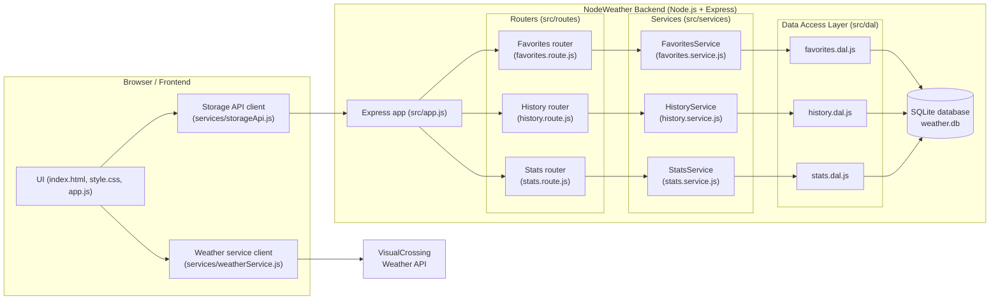

# Архітектура застосунку NodeWeather

## 1. Загальний огляд

NodeWeather — це клієнт–серверний застосунок для перегляду погоди, збереження улюблених міст та історії запитів.

До складу системи входять:

- **Frontend (HTML/CSS/JS + jQuery)**  
  - відображення інтерфейсу;
  - вибір країни/міста з великого списку (`current.city.list.json`);
  - виклики REST API бекенда для роботи з обраними містами та історією;
  - виклики зовнішнього погодного API для отримання фактичної погоди;
  - відображення аналітики (топ міст, кількість запитів).

- **Backend (Node.js + Express)**  
  - REST API `/api/favorites`, `/api/history`, `/api/stats`;
  - валідація даних;
  - бізнес-логіка роботи з історією переглядів та улюбленими містами;
  - агрегація статистики (топ міст, загальні лічильники, запити за день);
  - доступ до БД SQLite через шар DAL.

- **База даних SQLite (`weather.db`)**  
  - таблиця `favorites`;
  - таблиця `history`;
  - дані використовуються для побудови аналітики.

- **Зовнішній погодний API (VisualCrossing)**  
  - джерело фактичних даних про погоду;
  - викликається безпосередньо з фронтенда (через `weatherService.js`).

---

## 2. Компонентна діаграма (Mermaid)

Діаграма показує:

- браузер з трьома основними компонентами: UI, клієнт REST API бекенда, клієнт погодного API;
- бекенд, розбитий на **routers → services → DAL → SQLite**;
- окремий зовнішній сервіс погодних даних (VisualCrossing).

---

## 3. Архітектура backend

Backend реалізовано на основі **Express** і складається з декількох шарів.

### 3.1. Вхідна точка

- `src/index.js` — стартовий файл, який:
  - створює застосунок через `createApp()` з `src/app.js`;
  - вішає застосунок на порт (за замовчуванням `4000`);
  - логувує успішний старт сервера.

- `src/app.js`:
  - реєструє middleware `cors()` та `express.json()`;
  - надає health-check `GET /api/health` (перевірка живучості сервера);
  - підключає роутери:
    - `/api/favorites` → `favoritesRouter`;
    - `/api/history` → `historyRouter`;
    - `/api/stats` → `statsRouter`.

### 3.2. Роутери (HTTP-рівень)

- `favorites.route.js`:
  - `GET /api/favorites` — отримати список улюблених міст;
  - `POST /api/favorites` — додати місто в улюблені;
  - `DELETE /api/favorites/:name` — видалити конкретне місто;
  - `DELETE /api/favorites` — очистити всі улюблені (повертає `{ success: true, deleted }`).

- `history.route.js`:
  - `GET /api/history?limit=10` — остання історія переглядів;
  - `POST /api/history` — додати запис в історію;
  - `DELETE /api/history` — очистити історію повністю;
  - `DELETE /api/history/cleanup?days=30` — видалити записи старше N днів  
    (повертає `{ success: true, changed, beforeDate }`).

- `stats.route.js`:
  - `GET /api/stats/top-cities?limit=5` — топ міст за кількістю звернень;
  - `GET /api/stats/overview` — агреговані лічильники (`totalHistory`, `totalFavorites`);
  - `GET /api/stats/today?date=YYYY-MM-DD` — кількість запитів за конкретну дату.

Кожен роутер відповідає лише за HTTP-рівень: розбір параметрів, статус-коди, JSON-відповідь.

### 3.3. Сервісний шар (бізнес-логіка)

- `favorites.service.js`:
  - валідує назву міста, координати;
  - запобігає додаванню дублікатів;
  - повертає структуровані результати `{ changed }` для операцій видалення.

- `history.service.js`:
  - обмежує кількість записів (`limit`, типово `10`);
  - перевіряє обов’язкові поля (дата, місто);
  - забезпечує обрізання/очищення історії;
  - виконує очистку старих записів через `deleteHistoryOlderThan()`.

- `stats.service.js`:
  - нормалізує параметр `limit` для топ-міст (1..50, за замовчуванням 5);
  - рахує загальні лічильники (`totalHistory`, `totalFavorites`);
  - визначає поточну дату для `/today`, якщо параметр не передано;
  - повертає компактні DTO:
    - масив `{ city, count }` для топ-міст;
    - `{ totalHistory, totalFavorites }` для загального огляду;
    - `{ date, requests }` для статистики за день.

### 3.4. DAL (Data Access Layer) та SQLite

Файл `src/db/db.js`:

- налаштовує з’єднання з SQLite (`weather.db`);
- інкапсулює низькорівневі операції:
  - `all(sql, params)` — вибірка множини рядків;
  - `get(sql, params)` — вибірка одного рядка;
  - `run(sql, params)` — модифікуючі операції (INSERT/UPDATE/DELETE).

Файли DAL:

- `favorites.dal.js`:
  - працює з таблицею `favorites (id, name, lat, lon)`;
  - надає методи `getAllFavorites`, `findFavoriteByName`, `insertFavorite`, `deleteFavoriteByName`, `clearFavorites`.

- `history.dal.js`:
  - працює з таблицею `history (id, date, city, temp, conditions)`;
  - надає методи `getAllHistory`, `insertHistoryRecord`, `trimHistory`, `clearHistory`, `deleteHistoryOlderThan`.

- `stats.dal.js`:
  - будує агрегати на основі таблиць `history` та `favorites`;
  - `getTopCities(limit)` — `SELECT city, COUNT(*) AS count FROM history GROUP BY city…`;
  - `getTotals()` — повертає `{ totalHistory, totalFavorites }`;
  - `getTodayHistoryCount(date)` — повертає кількість записів в `history` за конкретну дату.

Важливо: **усі SQL-запити зосереджені в DAL**, тому:

- сервіси не працюють зі «сирим» SQL;
- спрощується тестування і рефакторинг;
- легше замінити SQLite на іншу БД при потребі.

---

## 4. Архітектура frontend

Фронтенд побудовано як односторінковий застосунок без важкого фреймворку.

### 4.1. Основні файли

- `index.html` — структура сторінки (форма пошуку, список міст, блок погоди, блок улюблених, історія, аналітика).
- `style.css` — стилізація, адаптивне верстання, стани кнопок.
- `app.js` — центральний сценарій, який:
  - зв’язує DOM з логікою;
  - ініціалізує обробники подій;
  - викликає `storageApi.js` і `weatherService.js`;
  - рендерить:
    - поточну погоду та прогноз;
    - список улюблених міст;
    - історію переглядів;
    - блок статистики (топ міст, лічильники).

- `services/weatherService.js`:
  - будує URL до VisualCrossing;
  - викликає погодний API, повертає JSON;
  - перевіряє `response.ok` і кидає помилки при невдалому запиті.

- `services/storageApi.js`:
  - інкапсулює виклики бекенд-API:
    - `/api/favorites`;
    - `/api/history`;
    - `/api/stats/*`;
  - повертає готовий JSON у зручному для UI форматі;
  - обробляє помилки відповідей (HTTP-коди 4xx/5xx).

- `storage.js`:
  - обгортка над `localStorage`:
    - `getFavorites`, `addFavorite`, `removeFavorite`, `clearFavorites`;
    - `getHistory`, `addHistory`, `clearHistory`, `resetAll`, `debugStorage`.
  - може використовуватися як локальний кеш або fallback.

- `current.city.list.json`:
  - великий список доступних міст з координатами;
  - використовується для вибору міста на фронтенді.

### 4.2. Потік даних на фронтенді

Типовий сценарій:

1. Користувач обирає місто зі списку.
2. `app.js` отримує його координати.
3. `weatherService.js` викликає VisualCrossing і повертає прогноз.
4. `app.js`:
   - оновлює блок поточної погоди та карти;
   - додає запис в історію через `storageApi.addHistory()` → бекенд → SQLite;
   - оновлює блок історії;
   - при додаванні в улюблені — викликає `storageApi.addFavorite()` → бекенд → SQLite і оновлює список улюблених.
5. Для аналітики:
   - `storageApi.getTopCities()` → `/api/stats/top-cities`;
   - `storageApi.getStatsOverview()` → `/api/stats/overview`;
   - `storageApi.getStatsToday()` → `/api/stats/today`.

---

## 5. Тестування та якість коду

### 5.1. Frontend

- **Jest + jsdom** — unit-тести для логіки роботи з `localStorage`.
- **Stryker** — мутаційне тестування для оцінки якості тестового покриття.
- **ESLint + Prettier** — перевірка стилю та автоформатування коду.
- Скрипти:
  - `npm test` — запуск Jest;
  - `npm run test:mut` — запуск Stryker;
  - `npm run lint` / `npm run lint:fix`;
  - `npm run format` / `npm run format:check`.

### 5.2. Backend

- **Jest + supertest**:
  - інтеґраційні тести REST API:
    - сценарії для favorites/history/stats;
    - перевірка статус-кодів;
    - перевірка структури JSON-відповідей.
- **ESLint + Prettier** — для стилю коду.
- Скрипти:
  - `npm test`;
  - `npm run lint`, `npm run lint:fix`;
  - `npm run format`, `npm run format:check`.

---

## 6. CI/CD

Для автоматизації перевірок застосунок інтегровано з **GitHub Actions** (workflow у репозиторії):

- На кожен `push` / `pull request`:
  - встановлюються залежності для `frontend` та `backend`;
  - запускаються:
    - ESLint;
    - Prettier (format-check);
    - unit-тести:
      - Jest на фронтенді;
      - Jest + supertest на бекенді;
    - (опційно) мутаційні тести Stryker.
- У разі помилки будь-якого етапу збірка вважається невдалою.

Така схема забезпечує:

- стабільну якість коду;
- відсутність «битих» тестів у гілці `main`;
- прозорий пайплайн для захисту лабораторної роботи.
