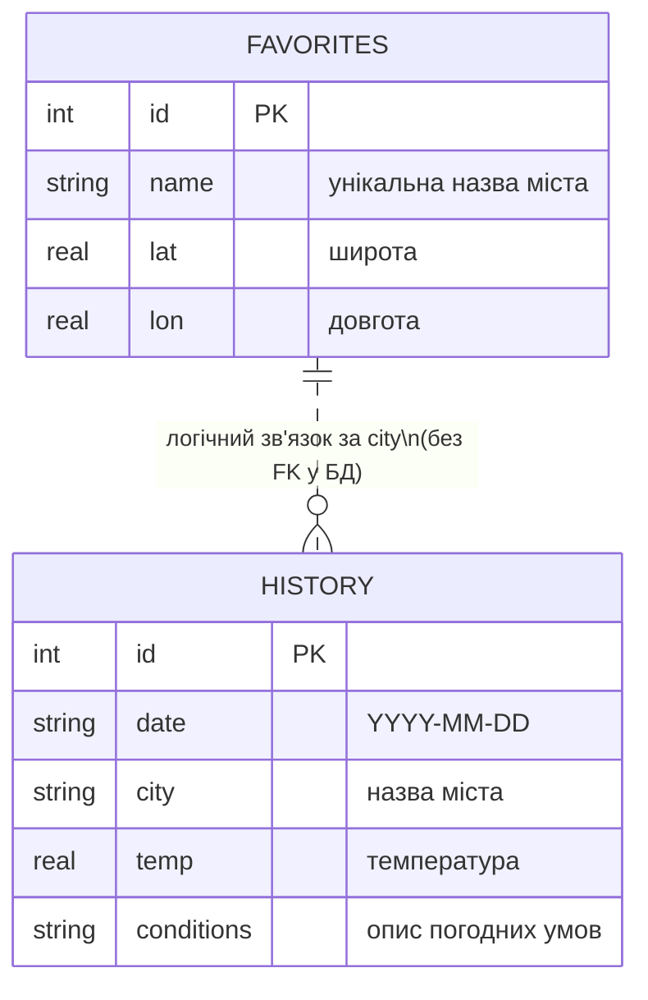

# Data Model — NodeWeather

## 1. Загальна концепція

Застосунок працює з декількома основними типами даних:

- **Улюблені міста** — міста, які користувач зберігає для швидкого доступу.
- **Історія переглядів** — записи про факти звернень за прогнозом погоди.
- **Аналітика** — агрегована статистика, яка обчислюється на основі історії:
  - топ найпопулярніших міст;
  - загальна кількість записів в історії;
  - кількість улюблених міст;
  - кількість запитів за поточний день.
- **Довідник міст** — великий список міст з координатами (`current.city.list.json`).
- **Погодні дані VisualCrossing** — фактична та прогнозна погода, що використовується для відображення на UI.

Постійне зберігання реалізовано через **SQLite** на бекенді, а також (для фронтенда / тестів) через **localStorage** у браузері.

Аналітика **не** зберігається в окремих таблицях — вона обчислюється «на льоту» SQL-запитами до таблиці `history` та `favorites`.

---

## 2. Структура БД SQLite

База даних `weather.db` містить дві основні таблиці: `favorites` та `history`.

### 2.1. Таблиця `favorites`

```sql
CREATE TABLE favorites (
  id   INTEGER PRIMARY KEY AUTOINCREMENT,
  name TEXT    UNIQUE NOT NULL,
  lat  REAL    NOT NULL,
  lon  REAL    NOT NULL
);
```

Семантика полів:

- `id` — технічний первинний ключ;
- `name` — назва міста (унікальне значення);
- `lat`, `lon` — координати міста (широта та довгота відповідно).

Використання:

- джерело даних для `GET /api/favorites`;
- база для відображення списку улюблених міст на фронтенді;
- участь у статистиці (загальна кількість улюблених міст).

### 2.2. Таблиця `history`

```sql
CREATE TABLE history (
  id         INTEGER PRIMARY KEY AUTOINCREMENT,
  date       TEXT    NOT NULL,
  city       TEXT    NOT NULL,
  temp       REAL,
  conditions TEXT
);
```

Семантика полів:

- `id` — технічний первинний ключ;
- `date` — дата запиту у форматі `YYYY-MM-DD`;
- `city` — назва міста, для якого було отримано прогноз;
- `temp` — температура (або середнє значення за день);
- `conditions` — текстовий опис погодних умов (наприклад, "Clear", "Rain").

Обмеження логіки:

- записи сортуються за `id DESC`, тому найсвіжіші звернення знаходяться на початку списку;
- методи DAL забезпечують:
  - обмеження кількості записів, що повертаються (`LIMIT ?`);
  - можливість видаляти записи старше певної дати (`DELETE WHERE date < ?`);
  - повне очищення історії.

---

## 3. ER-діаграма даних



Фактичного зовнішнього ключа в SQLite не задано, але на рівні бізнес-логіки:

- міста в історії співвідносяться з улюбленими через назву `city`;
- аналітика за містами (`top-cities`) рахується по таблиці `history`, незалежно від того, чи місто додано до `favorites`.

---

## 4. Моделі REST API backend

### 4.1. Favorites API

**GET `/api/favorites`**

Відповідь — масив об’єктів:

```json
[
  {
    "name": "Kyiv",
    "lat": 50.4333,
    "lon": 30.5167
  }
]
```

**POST `/api/favorites`**

Тіло запиту:

```json
{
  "name": "Kyiv",
  "lat": 50.4333,
  "lon": 30.5167
}
```

Відповідь у разі успіху — об’єкт або короткий статус (залежно від реалізації), наприклад:

```json
{
  "name": "Kyiv",
  "lat": 50.4333,
  "lon": 30.5167
}
```

У разі помилки валідації — статус `400` і об’єкт:

```json
{
  "error": "Invalid city name"
}
```

**DELETE `/api/favorites/:name`**

Відповідь:

```json
{
  "success": true,
  "deleted": 1
}
```

Якщо місто не знайдено — статус `404` і повідомлення про помилку.

**DELETE `/api/favorites`**

Очищення всіх улюблених:

```json
{
  "success": true,
  "deleted": 5
}
```

---

### 4.2. History API

**GET `/api/history?limit=10`**

Відповідь — масив об’єктів:

```json
[
  {
    "date": "2025-12-06",
    "city": "Kyiv",
    "temp": 1.5,
    "conditions": "Clear"
  }
]
```

**POST `/api/history`**

Тіло запиту (мінімальний приклад):

```json
{
  "date": "2025-12-06",
  "city": "Kyiv",
  "temp": 1.5,
  "conditions": "Clear"
}
```

У разі успіху повертається підтвердження додавання запису (або сам запис).  
У разі помилки валідації — статус `400` і опис помилки.

**DELETE `/api/history`**

```json
{
  "success": true,
  "deleted": 10
}
```

**DELETE `/api/history/cleanup?days=30`**

Відповідь:

```json
{
  "success": true,
  "changed": 3,
  "beforeDate": "2025-11-06"
}
```

---

### 4.3. Stats API

**GET `/api/stats/top-cities?limit=5`**

Відповідь:

```json
[
  { "city": "Kyiv", "count": 10 },
  { "city": "Lviv", "count": 4 }
]
```

**GET `/api/stats/overview`**

Відповідь:

```json
{
  "totalHistory": 23,
  "totalFavorites": 5
}
```

**GET `/api/stats/today?date=2025-12-06`**

Відповідь:

```json
{
  "date": "2025-12-06",
  "requests": 7
}
```

Якщо параметр `date` не передано, використовується поточна дата.

---

## 5. Моделі даних фронтенда

### 5.1. LocalStorage (файл `storage.js`)

Фронтенд може зберігати у `localStorage`:

- **Улюблені міста** (`FAVORITES_KEY = "favorites"`):

```json
[
  {
    "name": "Kyiv",
    "lat": 50.4333,
    "lon": 30.5167
  }
]
```

- **Історію переглядів** (`HISTORY_KEY = "history"`):

```json
[
  {
    "date": "2025-12-06",
    "city": "Kyiv",
    "temp": 1.5,
    "conditions": "Clear"
  }
]
```

Структури повністю узгоджені з моделями бекенда, що спрощує міграцію/синхронізацію.

### 5.2. Довідник міст (`current.city.list.json`)

Елемент списку міст має приблизно таку структуру:

```json
{
  "id": 14256,
  "name": "Azadshahr",
  "country": "IR",
  "coord": {
    "lat": 34.790878,
    "lon": 48.570728
  },
  "stat": {
    "population": 514102
  }
}
```

Фронтенд використовує насамперед:

- `name` — для відображення в списку;
- `country` — для додаткової інформації;
- `coord.lat`, `coord.lon` — для запитів до погодного API.

---

## 6. Погодні дані VisualCrossing

Приклад спрощеної відповіді від VisualCrossing (фактичні структури можуть бути ширшими):

```json
{
  "address": "Kyiv",
  "resolvedAddress": "Kyiv, Ukraine",
  "days": [
    {
      "datetime": "2025-12-06",
      "temp": 1.2,
      "tempmin": -1.0,
      "tempmax": 3.0,
      "conditions": "Clear",
      "feelslike": -0.5
    }
  ]
}
```

Фронтенд використовує:

- `days[0].temp`, `tempmin`, `tempmax`, `feelslike` — для відображення температур;
- `days[0].conditions` — для текстового опису та вибору піктограми;
- `address` / `resolvedAddress` — для виводу назви міста.

---

## 7. Відповідність вимогам лабораторної роботи

Оновлена модель даних відповідає вимогам ЛР:

- описані основні сутності:
  - улюблені міста;
  - історія переглядів;
  - аналітичні агрегати;
  - довідник міст;
  - погодні дані;
- для сутностей, що зберігаються в БД, наведена структура таблиць SQLite;
- показано логічні зв’язки між даними (`favorites` ↔ `history` через назву міста, аналітика поверх `history`);
- наведені формати JSON для всіх основних REST endpoint-ів;
- пояснено, як ці дані використовуються у фронтенді для:
  - збереження інформації;
  - побудови історії переглядів;
  - формування статистики та аналітики.
